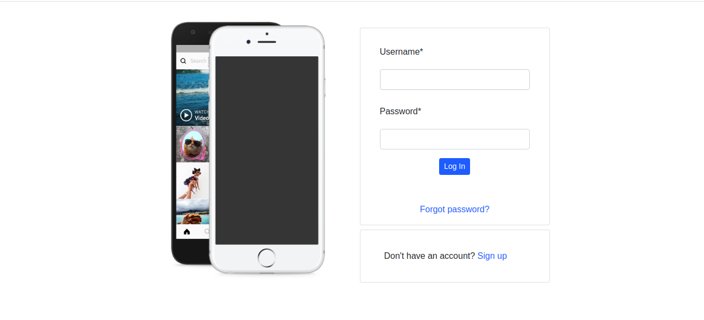

### For The Gram

### By Cecilia Barasa

## Description
An instagam clone

### Preview

### User stories
# As a user user you should be able to;
* Sign in to the application to start using.
* Upload my pictures to the application.
* See my profile with all my pictures.
* Follow other users and see their pictures on my timeline.
* Like a picture and leave a comment on it.

# Setup and installation requirements
* `Virtual environment`
* `pip install -r requirements.txt`

# Technologies used
* `Python3.6.9`
* `Django3.0.7`
* `HTML`
* `CSS`
* `JAVASCRIPT`

### 

## [Support and contact details](https://www.linkedin.com/in/cecilia-barasa-4a8311195/)
